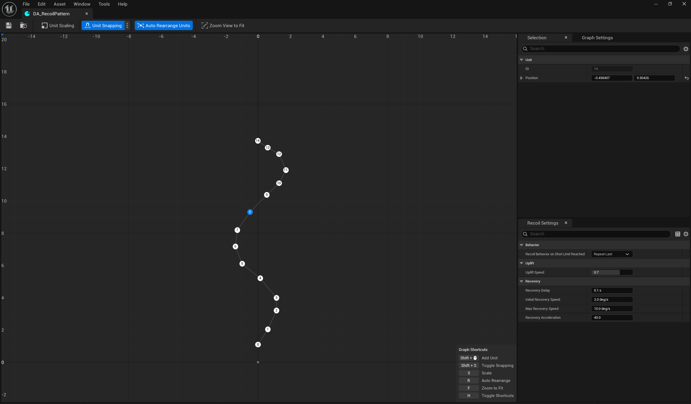

# Crystal Recoil

## Introduction

CrystalRecoil is an Unreal Engine plugin that provides a pattern-based recoil system for shooter games.
Define per-weapon recoil patterns visually using the built-in Recoil Pattern Editor,
then drive them at runtime through a Blueprint and C++ API.

## Features

- Pattern-Based Recoil System
- Custom Recoil Pattern Editor
- Blueprint Exposed API
- Recoil Recovery and Compensation
- Spread Recoil Component

## Installation

1. Get `CrystalRecoil.zip` from the [releases](https://github.com/Solessfir/CrystalRecoil/releases)
2. Extract it into your project's `Plugins` folder.
3. Enjoy!

## Usage

1. Add `CRRecoilComponent` to your Actor (Pawn, Weapon, etc.)
2. Implement `ICRRecoilInterface` on the same Actor, overriding:
   - `GetRecoilComponent` return the `CRRecoilComponent`
   - `GetTargetController` return the `APlayerController` to apply recoil to
3. Create a `CRRecoilPattern` Data Asset and configure the recoil pattern
4. Call `UCRRecoilComponent::SetRecoilPattern` to assign the pattern at runtime
5. On fire start: call `ICRRecoilInterface::StartShooting`
6. On each shot: call `ICRRecoilInterface::ApplyShot`
7. On fire end: call `ICRRecoilInterface::EndShooting`

## Recoil Pattern Behavior

When the player shoots beyond the defined pattern length, `ERecoilBehaviorOnShotLimitReached` controls what happens:

- **RepeatLast** - Repeats the last shot's delta indefinitely (AK-47 style infinite climb)
- **Stop** - Recoil stops, gun stabilizes at the last position (laser rifles, low-recoil weapons)
- **RestartFromCustomIndex** - Loops back to a specific shot index. Use `0` to restart the full pattern, or a higher index to loop only the sustained fire phase
- **Random** - Switches to procedural random recoil defined by `RandomizedRecoil` min/max ranges (LMGs, chaotic spray)

## Recoil Implementation Details

**Uplift:** 
Delta rotation is calculated from the recoil pattern coordinates. Using kinematic equations *(v₀ = 2d/T, a = 2d/T²)*, an initial speed and deceleration are derived that guarantee the camera travels exactly that distance in exactly the configured uplift duration. The deceleration is applied each tick until the full recoil is consumed.

**Compensation:** 
Player input that opposes accumulated recoil (e.g., pulling down while gun kicks up) reduces the recovery debt in real-time, allowing players to manually control recoil.

**Recovery:** 
After `RecoveryDelay`, the camera automatically returns toward the pre-shot position at a configurable speed and acceleration. Recovery can be canceled if the player makes large aiming movements (controlled by `RecoveryCancelThreshold`), allowing natural aim adjustments without fighting the system.

## Recoil Pattern Editor Shortcuts

- **Shift+Click**: Add Unit
- **Shift+S**: Toggle Snapping
- **S**: Scale
- **R**: Auto Rearrange
- **F**: Zoom View to Fit
- **H**: Toggle Shortcuts

## Recoil Spread Component

The plugin comes with a `UCRRecoilSpreadComponent`, which extends `UCRRecoilComponent` with a heat-based spread system.
Since it inherits all base recoil functionality, you only need one component - use `UCRRecoilSpreadComponent` instead of
`UCRRecoilComponent` if you want spread.

The spread effect is driven by three curves configured in the editor:

- `ShotToHeatCurve` - heat added per shot based on current heat
- `HeatToSpreadAngleCurve` - spread angle corresponding to the current heat
- `HeatToCooldownPerSecondCurve` - heat lost per second based on current heat

Call `UCRRecoilSpreadComponent::GetCurrentSpreadAngle()` before each shot to get the current spread angle for projectile direction calculation.

## License

This plugin is licensed under the MIT License